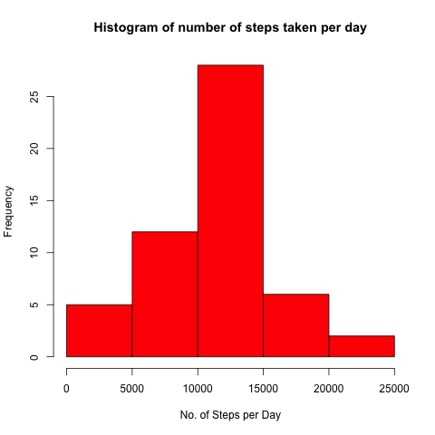
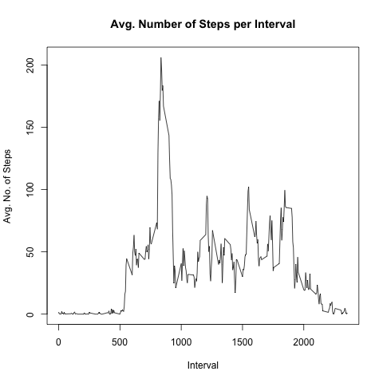
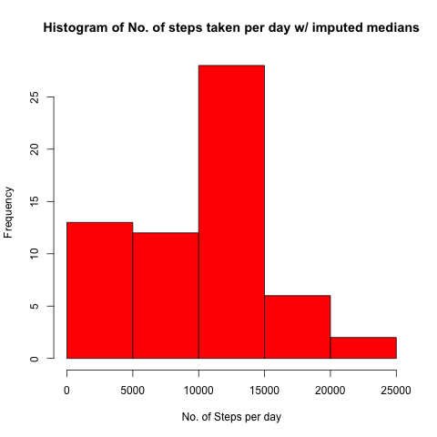
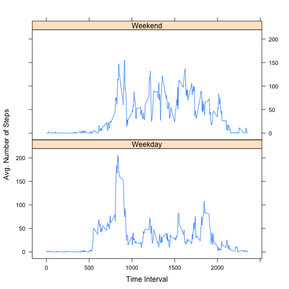

## Loading and preprocessing the data

NOTE: Make sure data zip file is unzipped in working directory before running following code

```{r, echo=TRUE} 
# load libraries
library(dplyr)
library(data.table)
library(lattice)
library(knitr)

# read data
data <- read.csv("activity.csv")

# create second df with NAs removed
df <- na.omit(data)
```

## What is the mean total number of steps taken per day?

1. Sum steps for each day

```{r, echo=TRUE}
# create group for dates
dategrp <- group_by(df, date)
        
# calculate sum of steps by date
dailysteps <- summarize(dategrp, sumsteps = sum(steps))
```

2. Create histogram of num of steps taken each day

```{r, echo=TRUE}
png(file = "figure/plot1.png")
hist(dailysteps$sumsteps, col = "red", main = "Histogram of number of steps taken per day", xlab = "No. of Steps per Day", ylab = "Frequency")
dev.off()
```



3. Calculate and report the mean and median of the total number of steps taken per day

```{r, echo=TRUE}
summarize(dailysteps, mean_steps=mean(sumsteps), median_steps=median(sumsteps))
```

## What is the average daily activity pattern?

1. Make a time series plot (i.e. 𝚝𝚢𝚙𝚎 = "𝚕") of the 5-minute interval (x-axis) and the average number of steps taken, averaged across all days (y-axis)

```{r, echo=TRUE}
# create group for intervals
intgrp <- group_by(df, interval)

# Calculate mean steps by interval
intsteps <- summarize(intgrp, avgsteps = mean(steps))

# Create time series plot
png(file = "figure/plot2.png")
plot(intsteps$interval, intsteps$avgsteps, type = "l", main = "Avg. Number of Steps per Interval", xlab = "Interval", ylab = "Avg. No. of Steps")
dev.off()
```



2. Find maximum average value and corresponding time interval

```{r, echo=TRUE}

# sort the interval data by descending average steps
sortdf <- arrange(intsteps, desc(avgsteps))

# print the first row - contains highest avg value and interval 
sortdf[1,]

```


## Imputing missing values

1. Calculate and report the total number of missing values in the dataset (i.e. the total number of rows with 𝙽𝙰s)

```{r, echo=TRUE}
sum(is.na(data$steps))
```

2. Fill in missing values with median of corresponding 5-minute interval

```{r, echo=TRUE}

DT <- data.table(data)
setkey(DT, interval)

```

3. Create a new dataset that is equal to the original dataset but with the missing data filled in.

```{r, echo=TRUE}
data2 <- DT[,steps := ifelse(is.na(steps), median(steps, na.rm=TRUE), steps), by=interval]
```

4. Make a histogram of the total number of steps taken each day and Calculate and report the mean and median total number of steps taken per day.

```{r, echo=TRUE}

# create group for dates
dategrp2 <- group_by(data2, date)
        
# calculate sum of steps by date
dailysteps2 <- summarize(dategrp2, sumsteps = sum(steps))

# create histogram of steps taken per day with imputed medians included
png(file = "figure/plot3.png")
hist(dailysteps2$sumsteps, col = "red", main = "Histogram of No. of steps taken per day w/ imputed medians", xlab = "No. of Steps per day", ylab = "Frequency")
dev.off()

# calculate and print mean and median of steps taken
summarize(data2, mean_steps=mean(steps), median_steps=median(steps))
```




## Are there differences in activity patterns between weekdays and weekends?

1. Create a new factor variable in the dataset with two levels – “weekday” and “weekend” indicating whether a given date is a weekday or weekend day.

```{r, echo=TRUE}
# add day of week column to data frame
data2$day <- weekdays(as.Date(data2$date))

# add weekday/weekend column (daycat) to data frame
        
        as.factor(data2$daycat[data2$day == 'Monday'] <- "Weekday")
        as.factor(data2$daycat[data2$day == 'Tuesday'] <- "Weekday")
        as.factor(data2$daycat[data2$day == 'Wednesday'] <- "Weekday")
        as.factor(data2$daycat[data2$day == 'Thursday'] <- "Weekday")
        as.factor(data2$daycat[data2$day == 'Friday'] <- "Weekday")
        as.factor(data2$daycat[data2$day == 'Saturday'] <- "Weekend")
        as.factor(data2$daycat[data2$day == 'Sunday'] <- "Weekend")
```

2. Create panel plot containing a time series plot (i.e. 𝚝𝚢𝚙𝚎 = "𝚕") of the 5-minute interval (x-axis) and the average number of steps taken, averaged across all weekday days or weekend days (y-axis).

```{r, echo=TRUE}
# create group for intervals
intgrp2 <- group_by(data2, interval, daycat)

# Calculate mean steps by interval
intsteps2 <- summarize(intgrp2, avgsteps2=mean(steps))

# create lattice plots to compare weekdays to weekends     
png(file = "figure/plot4.png")
xyplot(intsteps2$avgsteps2 ~ intsteps2$interval | intsteps2$daycat, type = "l", layout = c(1,2), xlab = "Time Interval", ylab = "Avg. Number of Steps")
dev.off()
```


