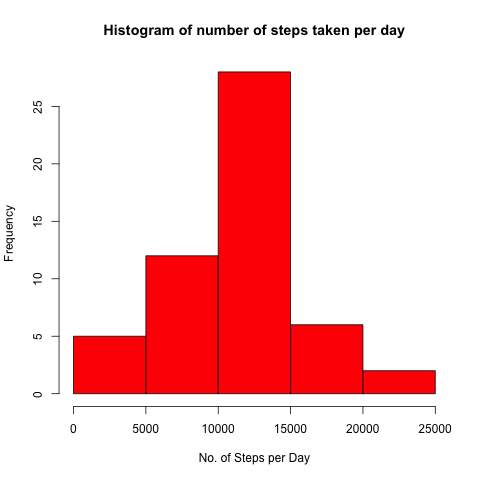
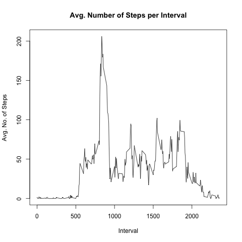
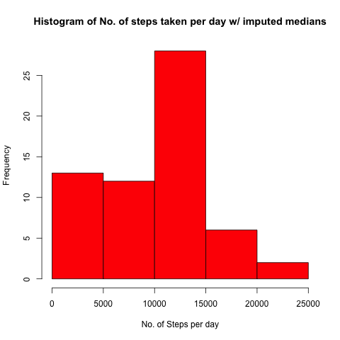
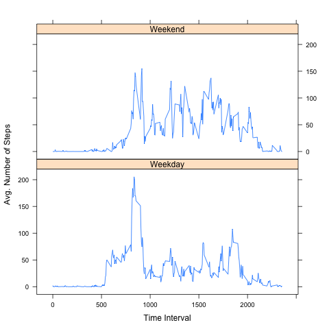

# Reproducible Research: Peer Assessment 1


## Loading and preprocessing the data

NOTE: Make sure data zip file is unzipped in working directory before running following code


```r
# load dplyr
library(dplyr)
```

```
## 
## Attaching package: 'dplyr'
## 
## The following objects are masked from 'package:stats':
## 
##     filter, lag
## 
## The following objects are masked from 'package:base':
## 
##     intersect, setdiff, setequal, union
```

```r
# read data
data <- read.csv("activity.csv")

# create second df with NAs removed
df <- na.omit(data)
```

## What is the mean total number of steps taken per day?

1. Sum steps for each day


```r
# create group for dates
dategrp <- group_by(df, date)
        
# calculate sum of steps by date
dailysteps <- summarize(dategrp, sumsteps = sum(steps))
```

2. Create histogram of num of steps taken each day


```r
png(file = "figure/plot1.png")
hist(dailysteps$sumsteps, col = "red", main = "Histogram of number of steps taken per day", xlab = "No. of Steps", ylab = "Frequency")
dev.off()
```

```
## quartz_off_screen 
##                 2
```



3. Calculate and report the mean and median of the total number of steps taken per day


```r
summarize(dailysteps, mean_steps=mean(sumsteps), median_steps=median(sumsteps))
```

```
## Source: local data frame [1 x 2]
## 
##   mean_steps median_steps
## 1   10766.19        10765
```

## What is the average daily activity pattern?

1. Make a time series plot (i.e. 𝚝𝚢𝚙𝚎 = "𝚕") of the 5-minute interval (x-axis) and the average number of steps taken, averaged across all days (y-axis)


```r
# create group for intervals
intgrp <- group_by(df, interval)

# Calculate mean steps by interval
intsteps <- summarize(intgrp, avgsteps = mean(steps))

# Create time series plot
png(file = "figure/plot2.png")
plot(intsteps$interval, intsteps$avgsteps, type = "l", main = "Avg. Number of Steps per Interval", xlab = "Interval", ylab = "Avg. No. of Steps")
dev.off()
```

```
## quartz_off_screen 
##                 2
```



2. Find maximum average value and corresponding time interval


```r
# sort the interval data by descending average steps
sortdf <- arrange(intsteps, desc(avgsteps))

# print the first row - contains highest avg value and interval 
sortdf[1,]
```

```
## Source: local data frame [1 x 2]
## 
##   interval avgsteps
## 1      835 206.1698
```


## Imputing missing values

1. Calculate and report the total number of missing values in the dataset (i.e. the total number of rows with 𝙽𝙰s)


```r
sum(is.na(data$steps))
```

```
## [1] 2304
```

2. Fill in missing values with median of corresponding 5-minute interval


```r
library(data.table)
```

```
## 
## Attaching package: 'data.table'
## 
## The following objects are masked from 'package:dplyr':
## 
##     between, last
```

```r
DT <- data.table(data)
setkey(DT, interval)
```

3. Create a new dataset that is equal to the original dataset but with the missing data filled in.


```r
data2 <- DT[,steps := ifelse(is.na(steps), median(steps, na.rm=TRUE), steps), by=interval]
```

4. Make a histogram of the total number of steps taken each day and Calculate and report the mean and median total number of steps taken per day.


```r
# create histogram of steps taken per day with imputed means included
png(file = "figure/plot3.png")
hist(data2$steps, col = "red", main = "Histogram of No. of steps taken per day w/ imputed means", xlab = "No. of Steps", ylab = "Frequency")
dev.off()
```

```
## quartz_off_screen 
##                 2
```

```r
# calculate and print mean and median of steps taken
summarize(data2, mean_steps=mean(steps), median_steps=median(steps))
```

```
##    mean_steps median_steps
## 1:   32.99954            0
```



Do these values differ from the estimates from the first part of the assignment? 


What is the impact of imputing missing data on the estimates of the total daily number of steps?


## Are there differences in activity patterns between weekdays and weekends?

1. Create a new factor variable in the dataset with two levels – “weekday” and “weekend” indicating whether a given date is a weekday or weekend day.


```r
# add day of week column to data frame
data2$day <- weekdays(as.Date(data2$date))

# add weekday/weekend column (daycat) to data frame
        
        as.factor(data2$daycat[data2$day == 'Monday'] <- "Weekday")
```

```
## [1] Weekday
## Levels: Weekday
```

```r
        as.factor(data2$daycat[data2$day == 'Tuesday'] <- "Weekday")
```

```
## [1] Weekday
## Levels: Weekday
```

```r
        as.factor(data2$daycat[data2$day == 'Wednesday'] <- "Weekday")
```

```
## [1] Weekday
## Levels: Weekday
```

```r
        as.factor(data2$daycat[data2$day == 'Thursday'] <- "Weekday")
```

```
## [1] Weekday
## Levels: Weekday
```

```r
        as.factor(data2$daycat[data2$day == 'Friday'] <- "Weekday")
```

```
## [1] Weekday
## Levels: Weekday
```

```r
        as.factor(data2$daycat[data2$day == 'Saturday'] <- "Weekend")
```

```
## [1] Weekend
## Levels: Weekend
```

```r
        as.factor(data2$daycat[data2$day == 'Sunday'] <- "Weekend")
```

```
## [1] Weekend
## Levels: Weekend
```

2. Create panel plot containing a time series plot (i.e. 𝚝𝚢𝚙𝚎 = "𝚕") of the 5-minute interval (x-axis) and the average number of steps taken, averaged across all weekday days or weekend days (y-axis).


```r
# load lattic library
library(lattice)
        
# create group for intervals
intgrp2 <- group_by(data2, interval, daycat)

# Calculate mean steps by interval
intsteps2 <- summarize(intgrp2, avgsteps2=mean(steps))

# create lattice plots to compare weekdays to weekends     
png(file = "figure/plot4.png")
xyplot(intsteps2$avgsteps2 ~ intsteps2$interval | intsteps2$daycat, type = "l", layout = c(1,2), xlab = "Time Interval", ylab = "Avg. Number of Steps")
dev.off()
```

```
## quartz_off_screen 
##                 2
```


